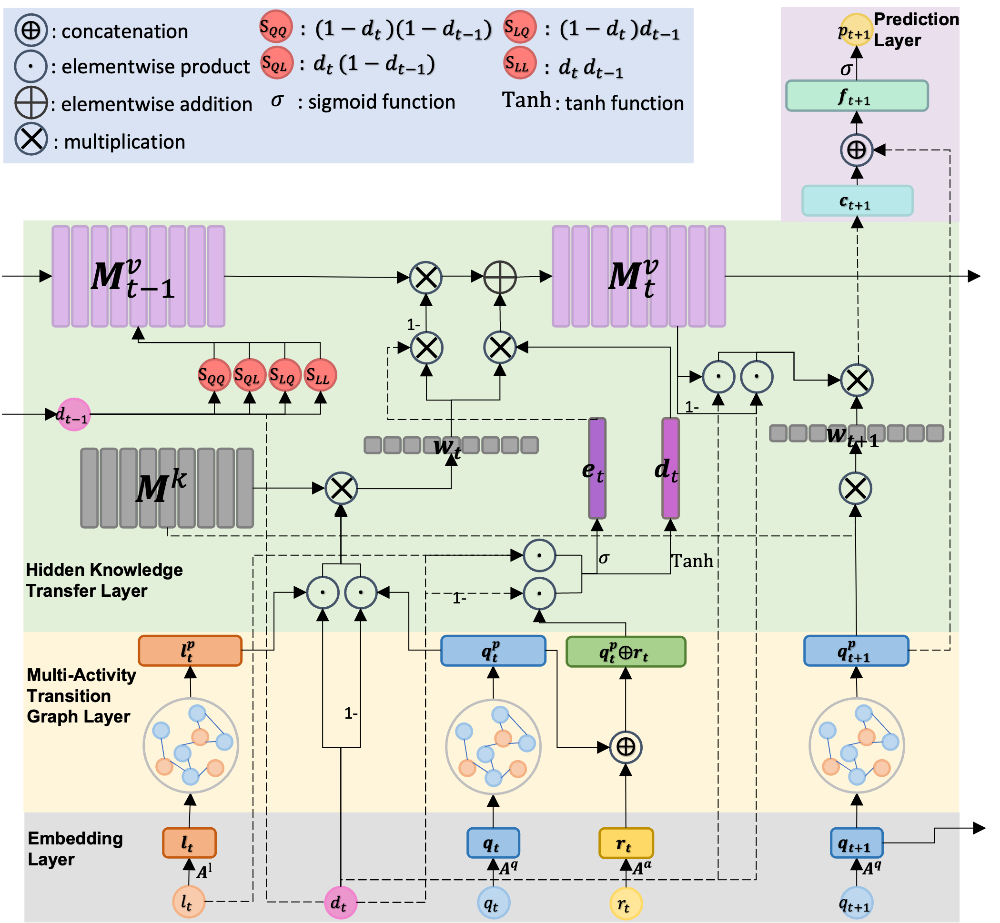

# Graph-Enhanced Multi-Activity Knowledge Tracing (GMKT)
Code for our paper:

 S. Zhao and S. Sahebi. TGraph-Enhanced Multi-Activity Knowledge Tracing. In Proceedings of European Conference on Machine Learning and Knowledge Discovery in Databases, ECML PKDD 2023.

If you have any questions, please email szhao2@albany.edu

## GMKT Network Architecture:




## Prerequisit
```angular2html
numpy
torch
scipy
sklearn
pickle
more_itertools
easydict
matplotlib
```

### How to install and run

```angular2html
git clone https://github.com/persai-lab/ECML-PKDD-GMKT
cd 2023-ECML-PKDD-GMKT
conda env create -f environment.yml
source init_env.sh
python run.py
```


## Cite:

Please cite our paper if you use this code in your own work:

```
@inproceedings{zhao2023GMKT,
  title={Graph-Enhanced Multi-Activity Knowledge Tracing},
  author={Zhao, Siqian and Sahebi,Shaghayegh},
  booktitle={European Conference on Machine Learning and Knowledge Discovery in Databases, ECML PKDD 2023},
  pages={},
  year={2023},
  organization={Springer}
}
```

## Collarators:
```angular2html
Siqian Zhao: szhao2@albany.edu
Sherry Sahebi: ssahebi@albany.edu
```

## Acknowledgement:

This paper is based upon work supported by the National Science Foundation under Grant No. 2047500.